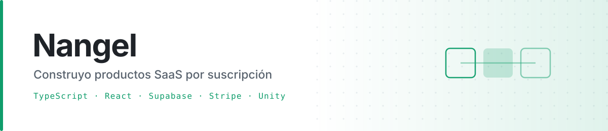

<picture>
  <source media="(prefers-color-scheme: dark)" srcset="assets/banner-dark.svg">
  <source media="(prefers-color-scheme: light)" srcset="assets/banner-light.svg">
  
</picture>

  

---

## 🧩 A qué me dedico realmente

La mayor parte de mi trabajo son **verticales de servicio** con el mismo esqueleto resuelto de extremo a extremo:

| | |
|---|---|
| 💳 **Suscripción completa con Stripe** | Checkout, webhooks, portal del cliente, cancelación, ofertas de retención y un proceso de reconciliación que vuelve a cuadrar la base cuando un webhook se pierde. |
| ⚡ **Backend sin servidor** | Supabase Edge Functions sobre Deno y PostgreSQL, con las políticas de acceso a nivel de fila. |
| 🛡️ **RGPD implementado, no prometido** | Exportación de los datos del usuario y borrado real de la cuenta. |
| 📬 **Mensajería** | Email transaccional, secuencias programadas, notificaciones push masivas y verificación por SMS. |
| 🌍 **Multi-idioma desde el día uno** | Porque el público no es solo español. |

> [!NOTE]
> Los modelos de lenguaje aparecen como una función más: llamadas a la API de Claude o Gemini
> desde una función de servidor. **Integro esas APIs; no entreno modelos ni investigo sobre ellos.**
> Prefiero decirlo a que se entienda otra cosa.

---

## ⚙️ Cómo trabajo

Desarrollo asistido por modelos. Uso Claude y herramientas de agente para escribir buena parte
del código; mi trabajo está en **decidir la arquitectura, escribir la especificación, revisar lo
que sale y comprobar que de verdad funciona**. Es la razón de que pueda sostener varios productos
a la vez, y lo digo abiertamente porque es parte del método y no algo que convenga esconder.

---

## 📦 Proyectos

<table>
<tr><th align="left">Proyecto</th><th align="left">Mi papel</th><th align="left">Qué es</th></tr>

<tr>
<td><a href="https://github.com/molinangel/Operia"><b>Operia</b></a></td>
<td><code>Autor</code></td>
<td>SaaS multi-inquilino para negocios de servicios: trabajos, presupuestos que el cliente aprueba desde el móvil y control de cobros. Next.js 16 · Prisma · autenticación propia con argon2id</td>
</tr>

<tr>
<td><a href="https://github.com/diego-landaeta/YourCVPassport"><b>YourCVPassport</b></a></td>
<td><code>Autor principal</code></td>
<td>Currículums con perfil público, exportación a PDF y DOCX y directorio de candidatos. React · Supabase · Gemini</td>
</tr>

<tr>
<td><a href="https://github.com/diego-landaeta/SH"><b>SH</b></a></td>
<td><code>Contribuidor clave</code></td>
<td>Gestión operativa sobre Supabase. React · shadcn/ui · PostgreSQL</td>
</tr>

<tr>
<td><a href="https://github.com/diego-landaeta/CRM"><b>CRM</b></a> · <a href="https://github.com/diego-landaeta/CRM-ISEIE">CRM-ISEIE</a></td>
<td><code>Contribuidor</code></td>
<td>CRM multiproyecto con backend propio. Express · PostgreSQL · React · S3</td>
</tr>
</table>

También soy **autor principal de varios verticales que siguen en repositorios privados**
—asistencia legal, veterinaria, nutrición y trabajos académicos—, con el mismo esqueleto de
suscripción y distinto dominio.

---

## 🎮 Fuera del trabajo

### PROTOCOLO · *party game* local en Unity 6

Para 2 a 4 personas en la misma sala. La gracia está en que **tus tareas están escritas en las
fichas de los demás**, y leer la ficha te congela en el sitio: hay que fiarse de que el otro te
lea bien y a tiempo.

<table>
<tr>
<td width="50%">

**Reparto en anillo**
El objetivo A de cada jugador lo lleva el siguiente y el B el anterior. Nadie ve nunca su propia
tarea, y el invariante se verifica en ejecución.

</td>
<td width="50%">

**Todo el arte por código**
Texturas, materiales, personajes y los cuatro sonidos se generan en tiempo de montaje. Ni un
asset descargado.

</td>
</tr>
<tr>
<td>

**Ajustado a una iGPU modesta**
Luz horneada, sin sombras en tiempo real, sin HDR ni MSAA. El presupuesto son 8,3 ms por fotograma.

</td>
<td>

**Compila sin abrir Unity**
Montaje, horneado de luz y ejecutable desde línea de comandos en modo batch.

</td>
</tr>
</table>

---

### 📫 Hablemos

