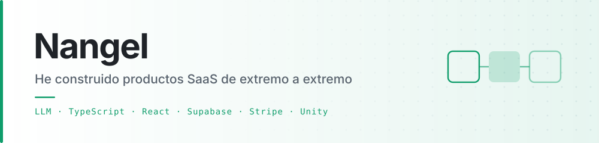
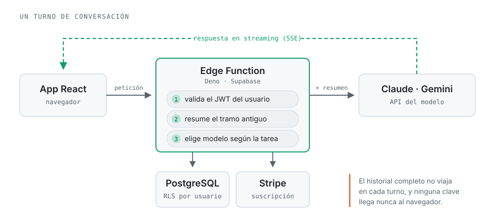
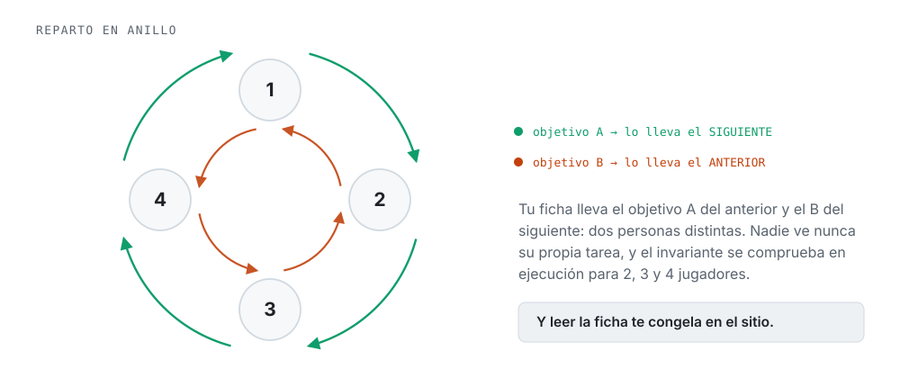

<picture>
  <source media="(prefers-color-scheme: dark)" srcset="assets/hero-dark.svg">
  <source media="(prefers-color-scheme: light)" srcset="assets/hero-light.svg">
  
</picture>

 

He construido productos SaaS de extremo a extremo: del esquema de la base de datos al cobro
recurrente, pasando por el backend, el panel de administración y la app que usa el cliente.
Seis de ellos tienen un modelo de lenguaje en el núcleo. Ahora estoy además con un juego en
Unity, que no se parece en nada a lo anterior y justo por eso me interesa.

---

## Productos con modelos de lenguaje

No es llamar a una API y pintar la respuesta. Casi todo el trabajo está alrededor del modelo:

<picture>
  <source media="(prefers-color-scheme: dark)" srcset="assets/arquitectura-dark.svg">
  <source media="(prefers-color-scheme: light)" srcset="assets/arquitectura-light.svg">
  
</picture>

Los pasos que dan trabajo de verdad son el **2** y el **3**. El segundo mantiene la memoria de
la conversación con un resumen rodante que absorbe al anterior: la ventana de contexto deja de
crecer y el historial entero no viaja en cada turno. Si un resumen sale degenerado se rechaza y
se reintenta al turno siguiente, en vez de contaminar el hilo para siempre. El tercero decide
qué modelo atiende cada cosa —uno pequeño comprime, renombra hilos y clasifica; el grande solo
entra donde se nota—, que es de donde sale la mayor parte del ahorro.

| Producto | Mi papel | Qué es |
|---|---|---|
| **[YourCVPassport](https://github.com/diego-landaeta/YourCVPassport)** | `Autor principal` | Currículums con perfil público, optimización del contenido con modelo, exportación a PDF y DOCX y directorio de candidatos |
| **Nutrición** · *privado* | `Autor principal` | Acompañamiento por chat con streaming, detección de objetivos, rachas y tareas generadas. El mayor de los seis: 28 funciones de servidor |
| **Asistencia legal** · *privado* | `Autor principal` | Análisis inicial del caso, preguntas guiadas y chat legal sobre plantillas administradas |
| **Veterinaria** · *privado* | `Autor principal` | Consulta asistida con recordatorios, informes en PDF y facturación |
| **Trabajos académicos** · *privado* | `Autor principal` | Editor enriquecido con fórmulas, tablas y diagramas, y exportación a DOCX y PPTX |
| **Tarot** · *privado* | `Autor principal` | Interpretación generada, numerología y horóscopo, con campañas y notificaciones |

> [!NOTE]
> Para ser preciso: **integro APIs de modelos** (Claude, Gemini) y construyo el producto
> alrededor —contexto, coste, streaming, fallos y permisos—. No entreno modelos ni investigo
> sobre ellos, y prefiero decirlo a que se entienda otra cosa.

---

## Plataforma, cobro y operación

Debajo de cada uno de esos productos hay el mismo esqueleto, resuelto entero:

| Pieza | Cómo está resuelta |
|---|---|
| **Suscripción con Stripe** | Checkout, webhooks, portal del cliente, cancelación, ofertas de retención y un proceso de reconciliación que vuelve a cuadrar la base cuando un webhook se pierde |
| **Backend sin servidor** | Supabase Edge Functions sobre Deno y PostgreSQL, con políticas de acceso a nivel de fila |
| **RGPD** | Implementado, no prometido: exportación de los datos del usuario y borrado real de la cuenta |
| **Mensajería** | Email transaccional, secuencias programadas, notificaciones push masivas y verificación por SMS |
| **Multi-idioma** | Desde el primer día, porque el público no es solo español |

Y fuera de los verticales, plataforma pura:

| Proyecto | Mi papel | Qué es |
|---|---|---|
| **[Operia](https://github.com/molinangel/Operia)** | `Autor` | SaaS multi-inquilino para negocios de servicios: trabajos, presupuestos que el cliente aprueba desde el móvil y control de cobros. `Next.js 16` · `Prisma` · autenticación propia con argon2id |
| **[SH](https://github.com/diego-landaeta/SH)** | `Contribuidor clave` | Gestión operativa sobre Supabase. `React` · `shadcn/ui` · `PostgreSQL` |
| **[CRM](https://github.com/diego-landaeta/CRM)** · **[CRM-ISEIE](https://github.com/diego-landaeta/CRM-ISEIE)** | `Contribuidor` | CRM multiproyecto con backend propio. `Express` · `PostgreSQL` · `React` · `S3` |

---

## Y algo que no se parece en nada: PROTOCOLO

*Party game* local en **Unity 6** para 2 a 4 personas en la misma sala. C# en vez de TypeScript,
y milisegundos por fotograma en vez de peticiones por segundo. La regla de la casa es esta:

<picture>
  <source media="(prefers-color-scheme: dark)" srcset="assets/anillo-dark.svg">
  <source media="(prefers-color-scheme: light)" srcset="assets/anillo-light.svg">
  
</picture>

| | |
|---|---|
| **Todo el arte por código** | Texturas, materiales, personajes y los cuatro sonidos se generan en tiempo de montaje. Ni un asset descargado |
| **Ajustado a una iGPU modesta** | Luz horneada, sin sombras en tiempo real, sin HDR ni MSAA. El presupuesto son 8,3 ms por fotograma |
| **Compila sin abrir Unity** | Montaje, horneado de luz y ejecutable desde línea de comandos, en modo batch |

---

## Cómo trabajo

Desarrollo asistido por modelos. Uso Claude y herramientas de agente para escribir buena parte
del código; mi trabajo está en **decidir la arquitectura, escribir la especificación, revisar lo
que sale y comprobar que de verdad funciona**. Es la razón de que pueda sostener varios productos
a la vez, y lo digo abiertamente porque es parte del método y no algo que convenga esconder.

---

## Herramientas

**A diario**

**También**

**He tocado, sin llamarme experto**

---

**¿Hablamos?**

